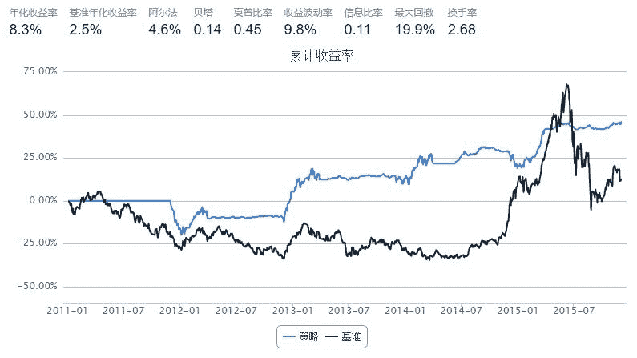

# 10% smallest cap stock

> 来源：https://uqer.io/community/share/5663e2f4f9f06c6c8a91b391

```py
import numpy as np
start = '2011-01-05'                       # 回测起始时间
end = '2015-12-01'                         # 回测结束时间
benchmark = 'HS300'                        # 策略参考标准
universe = StockScreener(Factor.LCAP.nsmall(40))
capital_base = 100000                      # 起始资金
freq = 'd'                                 # 策略类型，'d'表示日间策略使用日线回测，'m'表示日内策略使用分钟线回测
refresh_rate = 1                           # 调仓频率，表示执行handle_data的时间间隔，若freq = 'd'时间间隔的单位为交易日，若freq = 'm'时间间隔为分钟

def initialize(account):                   # 初始化虚拟账户状态
    account.empty = True

def handle_data(account):                  # 每个交易日的买入卖出指令
    today = account.current_date
    if today.month == 12 and account.empty:
        account.empty = False
        for stock in account.universe:
            p = account.referencePrice.get(stock, 0)
            if np.isnan(p) or p == 0:
                continue
            order_pct_to(stock, 0.025)
    elif today.month == 4 and not account.empty:
        account.empty = True
        for stock in account.universe:
            if stock in account.valid_secpos:
                order_to(stock,0)
```



