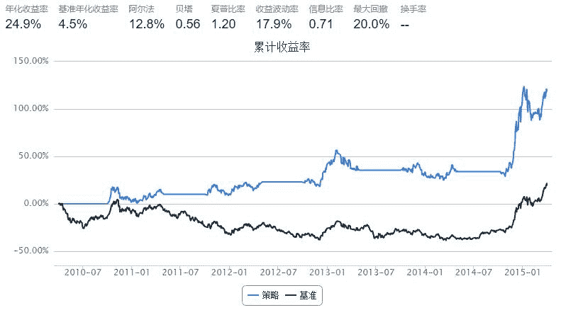

# Halloween cycle 2

> 来源：https://uqer.io/community/share/54ae4117f9f06c276f651a07

## 策略思路

“万圣节效应”：每年10月到次年5月，股票市场会出现上涨的趋势

## 策略实现

+ 股票池：流动性充足的10只个股，包括工商银行、中国石化等
+ 每年10月，将账户中现金平均分成10份，分别买入相应的10只个股，满仓；次年5月全部抛出，空仓

```py
start = '2010-04-01'                       # 回测起始时间
end = '2015-04-01'                         # 回测结束时间
benchmark = 'HS300'                        # 策略参考标准
# 证券池,流动性充足的10只个股
universe = ['601398.XSHG', '600028.XSHG', '601988.XSHG', '600036.XSHG', '600030.XSHG', '601318.XSHG', '600000.XSHG', '600019.XSHG', '600519.XSHG', '601166.XSHG']
capital_base = 100000                      # 起始资金
longest_history = 1                       # handle_data 函数中可以使用的历史数据最长窗口长度
refresh_rate = 1                           # 调仓频率，即每 refresh_rate 个交易日执行一次 handle_data() 函数

def initialize(account):                   # 初始化虚拟账户状态
    pass

def handle_data(account):                  # 每个交易日的买入卖出指令
    yesterday = account.get_attribute_history('closePrice',1)
    for stock in account.universe:
        today = account.current_date
        if stock not in account.valid_secpos and (today.month == 10):  # 10月买入
            # 现金平均分成10份，买入
            amount = int(account.cash/len(account.universe)/ yesterday[stock][0])
            order(stock, amount)
            
        elif stock in account.valid_secpos and (today.month == 5):   # 5月卖出
            order_to(stock, 0)
```



