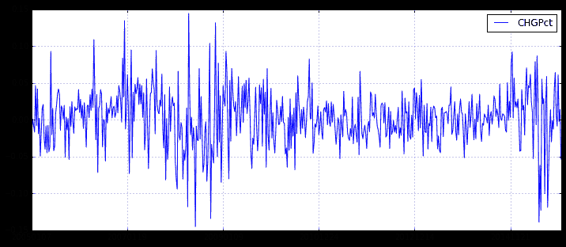
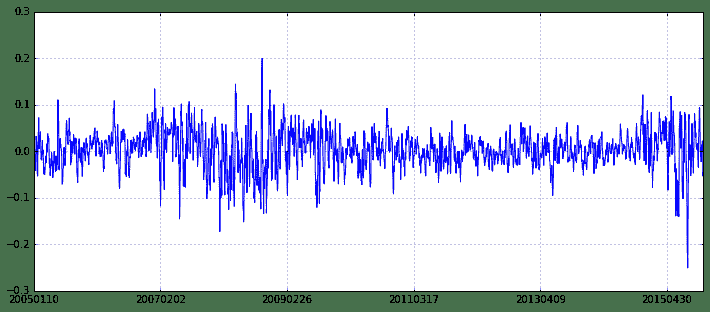

# 3.5 暴涨暴跌 • [实盘感悟] 遇上暴跌我该怎么做？

> 来源：https://uqer.io/community/share/565d47e3f9f06c6c8a91af49

## 写贴缘由：

+ 经历了上周五的大跌以及昨天的深V反转，这行情真是吓死宝宝了。。。

+ 好在这次还算淡定，没有在低点出货，算是理智战胜了恐惧吧（具体我相信其不会继续暴跌的原因详见后面）

+ 所以痛定思痛，好好反思总结，来说说暴跌我该怎么办吧

## 回首历史：

记得在7,8月份大跌时，我做过一个简单的统计，统计了上证综指历史上所有周度的涨跌幅，统计后发现，大部分的涨跌幅都位于（-5%，5%），一些极端情况会出现涨跌10%左右，跌的最多的好像也就15%左右，而且即使在熊市，跌多了也会短期反弹一点，用专业的话讲，应该算是下跌趋势中的短期反转吧（momentum&reverse）。

所以，当时面对当时的下跌，我并没有太绝望，我在等的也就是反转的机会，而且不承担选股风险，就买带杠杆的分级B，快进快出，这样熊市下来我并没有亏损太多，甚至略微有盈利。

那么问题来了，怎么判定反转呢？不然这些都是大白话。我的想法也非常简单，既然历史（当时主要是07,08年的）统计表明跌幅超过15%之后再继续下跌的概率不高，那么一旦跌幅超过15%我在入场抄底，反转的机会是不是很高呢？说起来很简单吧，但做起来呢？

做起来就没那么简单了，人毕竟是感性的，遇上满仓跌停你的第一感觉就是将亏损和工资or奖金匹配了，这个时候都是恐惧，所以才出现了巨幅的跳水，因为大部分人都已经没法正常思考了（比如你当时想买某个分级B，你绝对不太会像之前一样理性，先要看看分级基金整体折溢价如何。。）

但这个时候就是真正的机会，别人恐惧时你要贪婪。想在想想当时7、8月份的行情，有很多曾经盘中一度跌幅超过15%的吧，这其实都是很好的抄底时机，但在熊市里，抄底要注意快进快出！ 

先来看看上证综指的历史周度收益吧

```py
import lib.BGI as BGI 
import pandas as pd
import numpy as np

quotes_daily = DataAPI.MktIdxdGet(ticker='000001', beginDate='20050101', field='tradeDate,CHGPct', pandas='1').set_index('tradeDate')
quotes_daily.index = map(lambda x: x.replace('-', ''), quotes_daily.index)
quotes_weekly = BGI.daily2weekly(quotes_daily, 'sum') # 周度行情
quotes_weekly.plot(figsize=(12,5))

<matplotlib.axes.AxesSubplot at 0x4d19f50>
```



怎么样，大部分都是位于（-5%，5%）吧，只有在熊市里才有超过10%的，但都没有超过15%。所以，在某一周中，盘中跌幅超过15%，那抄底还是挺自信的，更何况，现在的行情已经有企稳迹象，并非像7、8月份的熊市，怕什么呢？看看上周四、周五、再加昨天盘中的最大跌幅，刚刚好10%，敢问各位，抄底了吗？

当然，我也好奇的统计了，大盘过去N天的跌幅情况，以及随后M天的反弹情况，统计了收益为正的概率等等（统计规律没太多投资逻辑，仅供参考）

```py
# 输入原始daily行情，获取行情统计信息，统计过去before_days的收益，以及随后after_days的收益
def get_quotes(row_quotes, before_days, after_days):
    quotes_Ndays = pd.DataFrame(index=row_quotes.index[before_days-1:], columns=['before '+str(before_days)+'days return','after '+str(after_days)+'days return'], data=0.0)
    for i in range(before_days-1,row_quotes.shape[0]):
        quotes_Ndays.iloc[i-before_days+1,:] = [row_quotes.iloc[i-before_days+1:i+1]['CHGPct'].values.sum(),row_quotes.iloc[i+1:i+1+after_days]['CHGPct'].values.sum()]
    return quotes_Ndays
```

下图是上证综指过去五天的累计收益图（没有按照周来划分），可以看到，结果差不多，连续五天下跌幅度超过10%的非常少，只有在8月份的熊市里，才出现过一次20%！

```py
quotes_Ndays = get_quotes(quotes_daily, 5, 1)
quotes_Ndays[quotes_Ndays.columns[0]].plot(figsize=(12,5))

<matplotlib.axes.AxesSubplot at 0x4d0c310>
```



接下来，就简单统计一下，上证综指在连续五天分别下跌10%、15%、20%，在随后的1天、2天、3天、4天、5天内行情的均值收益以及收益为正的概率。

```py
res = pd.DataFrame(index=['drawdown 10%','drawdown 15%','drawdown 20%'], columns=['following 1 day','following 2 day','following 3 day','following 4 day','following 5 day'])
for i in range(1,6):
    tmp_quote = get_quotes(quotes_daily, 5, i)
    tmp1 = tmp_quote[tmp_quote['before 5days return'] <= -0.1]['after '+str(i)+'days return']
    tmp2 = tmp_quote[tmp_quote['before 5days return'] <= -0.15]['after '+str(i)+'days return']
    tmp3 = tmp_quote[tmp_quote['before 5days return'] <= -0.2]['after '+str(i)+'days return']
    res.loc['drawdown 10%',res.columns[i-1]] = (np.round(tmp1.mean(), 4), np.round(float(sum(tmp1>0))/len(tmp1), 3))
    res.loc['drawdown 15%',res.columns[i-1]] = (np.round(tmp2.mean(), 4), np.round(float(sum(tmp2>0))/len(tmp2), 3))
    res.loc['drawdown 20%',res.columns[i-1]] = (np.round(tmp3.mean(), 4), np.round(float(sum(tmp3>0))/len(tmp3),3))
res
```


| | following 1 day | following 2 day | following 3 day | following 4 day | following 5 day |
| --- | --- | --- | --- | --- | --- |
| drawdown 10% | (-0.001, 0.524) | (0.0067, 0.595) | (0.0078, 0.524) | (0.0081, 0.5) | (0.0077, 0.548) |
| drawdown 15% | (0.0076, 0.667) | (0.017, 0.667) | (0.0408, 0.833) | (0.0223, 0.667) | (0.0208, 0.667) |
| drawdown 20% | (-0.0119, 0.333) | (0.0178, 0.667) | (0.0489, 0.667) | (0.0582, 1.0) | (0.0507, 1.0) |

如上表所示：

+ 每个单元格是一个tuple，第一个值为收益率的均值，第二个值为收益率为正的概率，举例来说，第一个元素(-0.001, 0.524)表示上证综指过去5天下跌超过10%的情况下，在随后1天的行情中，所有收益率的均值为-0.001，所有收益率中收益为正的概率为0.524

+ 可以看到，从收益均值角度看，基本上都能获得正的收益，而且多持有几天，获得均值正收益越多，上证综指3%左右还是很不错的收益

+ 从概率的角度看，都能明显高于50%

当然，以上仅仅是一些历史统计规律，具有一定的参考性，个人可根据实际情况来进行抉择！

## 回到现在：

关于这一波下跌，市场也并没有给出一个明确的原因（或许是券商收益互换？美联储加息？？？。。。）

总之，现在还没有到7,8月份时候清理两融、清配资来得直接，此外现在点位相对来说不算太高，顶多算是给前期涨幅太多降降温；而且随着人民币“入篮”，今天的PMI数据也有企稳迹象，总总迹象都表明政府主导的结构性改革正在有序进行。

也许大盘还会继续跌（当然啦，我是不相信会跌到3000点的，而且个人觉得接下来的行情会不错~），因为北上的沪港通已经帮我建立一个牢靠的成本线（参见社区帖子https://uqer.io/community/share/564a9754f9f06c4446b48253，强烈建议去看一下），你不抄底，他们会抄底，不信的话请看这两天的沪股通流入额！ 

## 总结：

+ 单单通过历史统计规律来决定是否抄底确实有点草率，但历史规律性的东西还是很具有参考价值的，好歹技术指标的一大前提就是相信历史会重演

+ 实际运用中，还有结合当时的市场环境，是下跌趋势还是企稳震荡又或是上涨，当然还可以分析一下国内环境、国际环境、又或是一些其他指标（比如这里提到的沪港通）

+ 总之，遇上暴跌不要恐慌，做一名理性的投资者！从本文的角度来看，暴跌不正是千载难逢的好机会吗？

